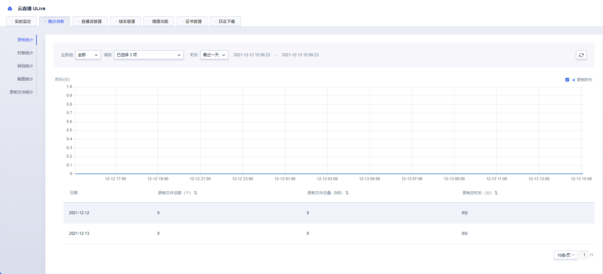
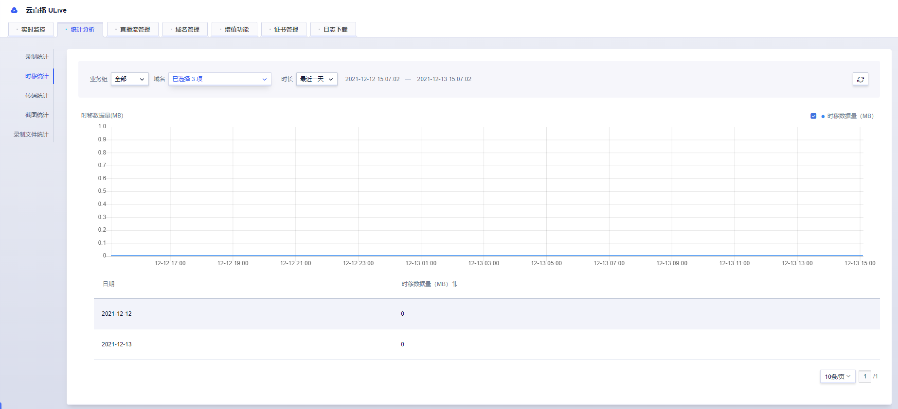
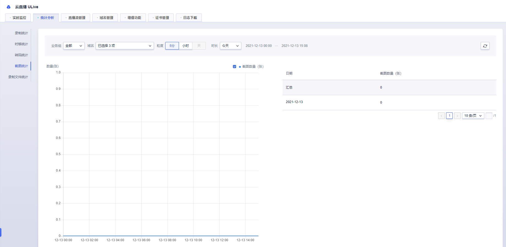

# 统计分析

统计分析主要提供录制统计、时移统计、转码统计、截图统计、录制文件统计等数据信息。

## 录制统计

默认记录最近一天的录制文件个数、文件大小（MB）和录制时长（分），最长可查询32天的数据，可选择一个或多个推流域名。

## 时移统计

默认记录最近一天的时移数据量（MB），最长可查询32天的数据，可选择1个或多个推流域名。

## 转码统计

默认记录当天的转码数据，最长可查询32天的数据，可选择1个或多个域名查询。

## 截图统计

默认记录当天的截图数量（张），最长可查询32天的数据，可选择1个或多个域名查询。

## 录制文件统计

默认记录最近一天单个域名对应接入点的录制文件数据，也可以根据流ID查询

