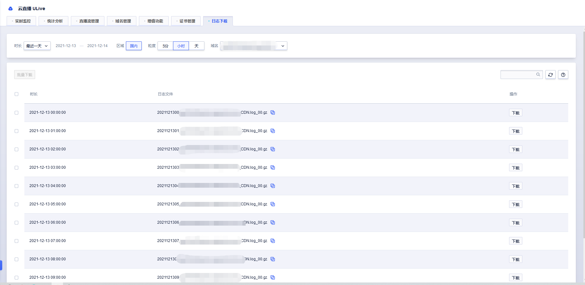

# 日志下载

默认展示最近一天的分时日志，可按照分钟或者天粒度下载日志。

默认配置格式如下:

  > $time    $command      $uuid    $user_addr     $node_addr      $domain    $app      $name     $in_bytes     $out_bytes     \"$param\"     \"$uri\"      \"$ua\"    $return    \"$status\"    $utime"     $hit 

## 日志格式说明

|字段|	说明	|例子|
|---|---|---|
|$time	|ISO8601时间格式	|2021-12-13T00:00:01|
|$command	|记录流的状态，具体内容显示参考[备注1](../ulive/DOING/logs.md#备注1)	|flv play|
|$uuid	|uuid字符串，用于准确区分每次连接	|db248fdf-1712-406f-b276-0084ed1cc2f7|
|$user_addr	|播放用户或推流主播IP地址	|127.0.0.1|
|$node_addr	|播放用户或推流主播所连接的服务器节点ip地址	|127.0.0.1|
|$domain	|播放用户所请求域名	|test.publish.alixie.com|
|$app	|接入点	|live|
|$name	|流ID	|ucloud|
|$in_bytes	|节点接收到数据,单位bytes	|3539|
|$out_bytes	|节点已发送数据,单位bytes	|3539|
|\"$param\"	|请求所带参数，不包括"?"之前的字符串	|"UliveHost=test.publish.alixie.com&source=transcode_codec&no_resume=1"|
|\"$uri\"	|Http请求的URI, RTMP	|/live/ucloud.flv|
|\"$ua\"	|Http请求的user_agent,rtmp的flash版本	|Wget/1.19.1 (linux-gnu)|
|$return	|返回的状态码	0
|\"$status\"	|链接状态，具体内容显示参考[备注2](../ulive/DOING/logs.md#备注2)	|normal|
|$utime"	|用户从连接到结束所用时长, 单位为ms	|30179|
|$hit	|"Hit", "Miss",缓存是否命中	|HIT|

----------------------
### 备注1

|$command值|说明|
|----|----|
|flvplay	|HTTP-FLV,HTTPS_FLV播放开始|
|flvclose	|HTTP-FLV,HTTPS_FLV播放结束|
|rtmpplay	|RTMP播放开始|
|rtmppublish	|RTMP推流开始|
|rtmpclose	|RTMP播放及推流结束|
|以下类型包括只记录结束：	|
|hlsm3u8	|HLSM3U8请求访问|
|hlsts	|HLSTS请求访问|
|httprequest	|其它HTTP请求|

### 备注2

| $status | 说明  |
|--------|-------|
|InitStatus              |直播状态未知，初始为这个状态|
|StreamEOF               |直播流正常结束|
|StreamForbidden         |直播流被禁止播放或者推流|
|StreamNotFound          |直播流不存在|
|StreamTimeout           |直播流源超时|
|PublishChange           |直播流新主播替换了旧主播，断开旧主播连接|
|StreamCodecChange       |直播流编码信息发生变化，导致的断流|
|UserEOF                 |用户明确结束(HTTP-FLV, HTTP-HLS没有)|
|UserFIN                 |用户主动断开连接|
|UserTimeout             |用户超时|
|UserAuthFailed          |用户鉴权失败|
|UserError               |用户数据异常|
|RecordError             |超过切片最大时间的2倍，还没产生切片，流异常|
