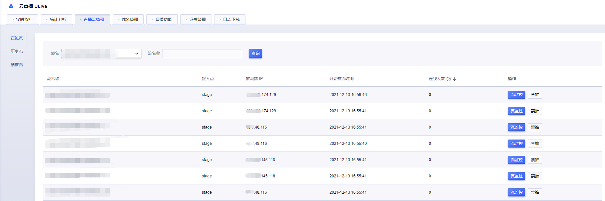
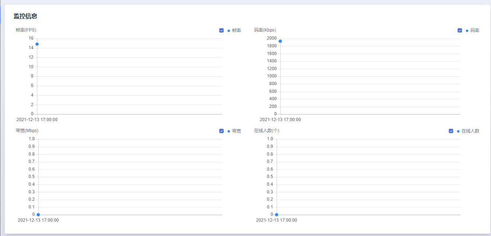
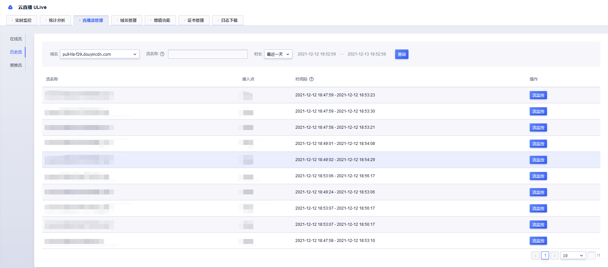

# 直播流管理

直播流管理提供推流域名流查询，包括在线流，历史流以及禁推流三种。

## 在线流

通过域名查询，也可以通过域名+流名称查询，展示对应域名的流名称、接入点、推流端IP、开始推流时间和在线人数数据，并支持对在线流禁推。

点击流监控，可查看单个流信息

## 历史流

通过域名查询时间段内的推流信息，也可以通过域名+流名称查询，展示对呀流名称、接入点和时间段，点击流监控，可查看单个流信息。

## 禁推流

查看推流域名已经设置禁推的流记录，也可以解除禁推。

