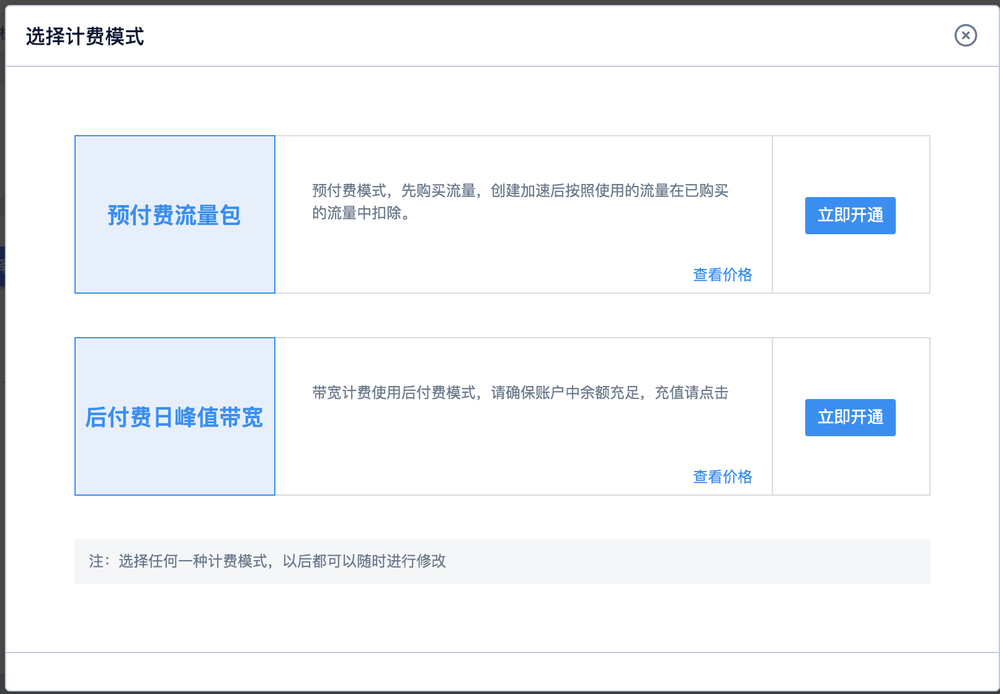

# 开通Ulive服务

本章目的在于指导初次使用产品的用户如何快速上手使用云直播。

## 前提条件

您需要完成UCloud账户注册和实名认证后，即可开通Ulive服务。

操作步骤

1.录UCloud控制台，点击进入Ulive产品界面

2.点击【选择计费方式】，根据您的业务类型选择合适的计费模式。

默认的计费方式为两种：预付费流量包和日带宽峰值计费，预付费流量包需先购买流量后，才能接入域名，详细计费规则请参考：

注：若要开通日宽峰值后付费，需提前联系客户经理开通权限。