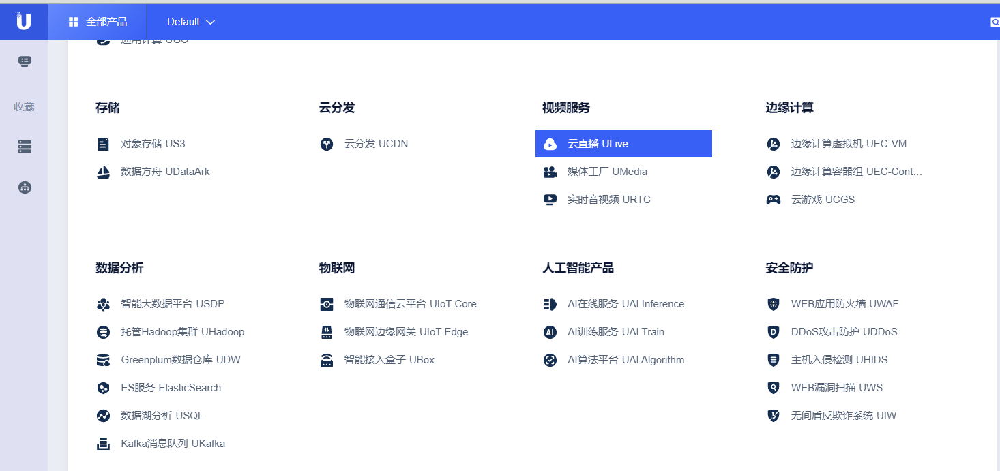
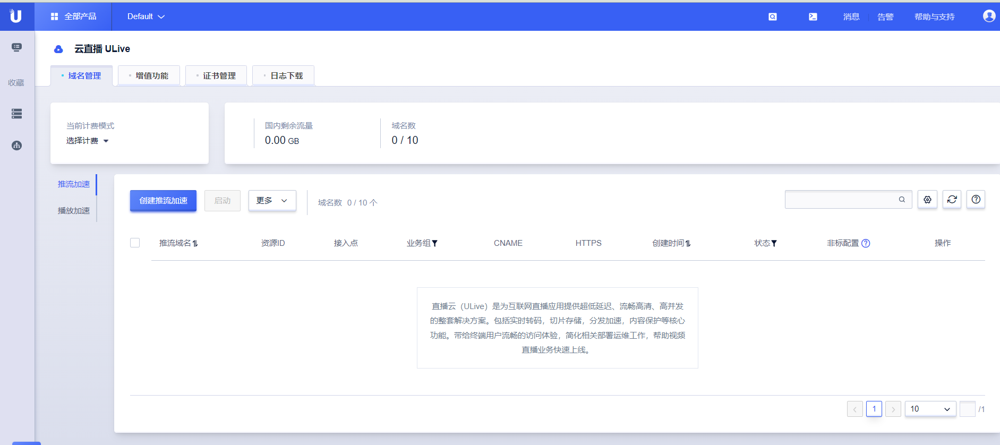
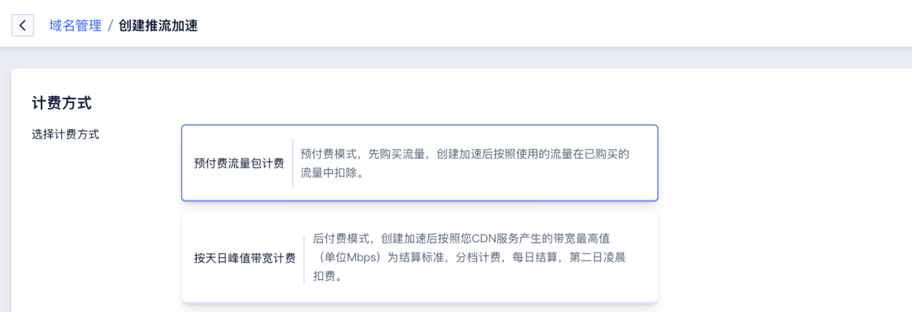

# 开通Ulive服务

本章目的在于指导初次使用Ulive产品的用户如何快速上手使用云直播(Ulive)。

## 前提条件

您需要完成UCloud账户注册和实名认证后，即可开通Ulive服务。

操作步骤

* 1.登录UCloud控制台，点击进入Ulive产品界面；

* 2.配置您的域名，需要准备已完成ICP备案的域名（Ulive不支持泛域名加速），点击【创建推流加速】

* 3.选择计费方式，默认的计费方式为两种：预付费流量包和日带宽峰值计费，预付费流量包需先购买流量后，才会提交域名配置。

详细计费规则请参考：[Ulive产品计费](../charge.md)

注：若要开通月付费，需提前联系客户经理开通权限。

* 4.在选择计费方式之后，可对第一个域名进行配置，点击购买确认之后，生成域名配置。
