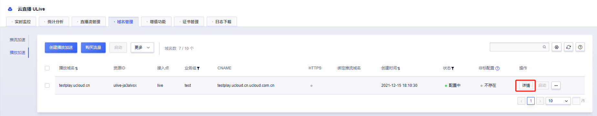
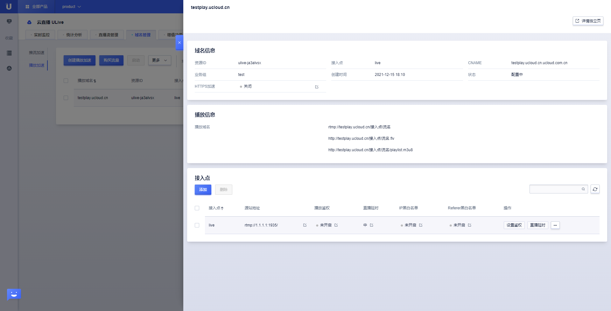
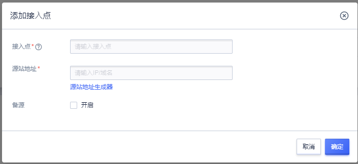
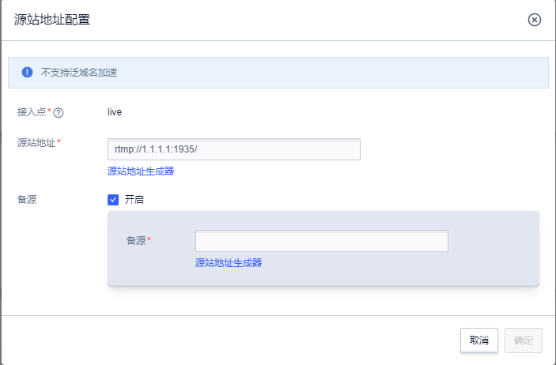
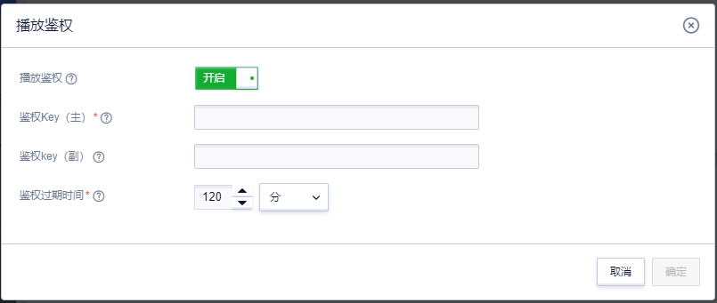
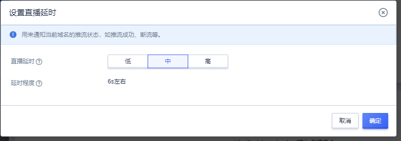
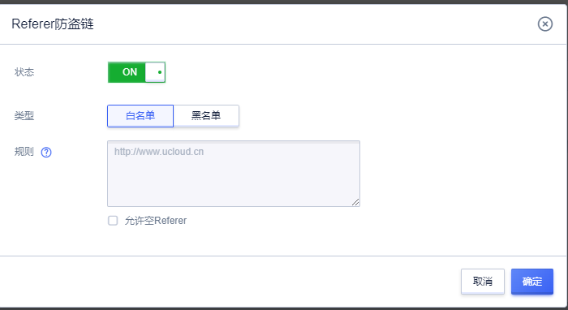

# 播放域名配置

目前播放域名配置支持设置源站地址，播放鉴权，直播延时，IP黑白名单，referer黑白名单；如需其他配置，请联系技术支持进行非标配置。

在域名管理——播放加速列表，点击需要配置域名后的【详情】，进入域名配置。

右边抽屉页面弹出配置详情页，显示基本域名信息和配置信息；

具体域名信息包括，资源ID，接入点，CNAME，业务组，创建时间，状态和HTTPS加速，除了HTTPS加速，其他内容无法在此修改。

配置信息以接入点为粒度显示，若配置源站为推流域名，则接入点继承推流域名配置的接入点，若配置源站为自定义源站，则可增加或者删除接入点（可批量删除），但最少要有1个接入点，不支持修改接入点名称，支持每个接入点，独立配置。

## 修改源站地址配置

源站地址，可修改协议，IP和端口号，但无法从自定义源站调整为推流域名，需要删除该域名配置再重新添加选择源站为推流域名。

## 播放鉴权

直播鉴权功能即为直播“MD5防盗链”。

ULive可以采用对url某些字段进行md5加密的方法，来校验url是否合法，防止域名被盗用，产生高额流量。

客户若有特殊鉴权需求时，请联系UCloud技术支持协助非标配置。

### 鉴权策略

鉴权总体策略为用户按照规则生成如下的链接:

rtmp://abc.com/application/mystream?k=xxxxxx&t=yyyy

1)t为16进制的服务器时间戳

2)k为经过md5加密的字符串，生成规则为:k=md5(约定密钥+流路径+t),

本例中，流路径为"/application/mystream "

ULive服务器会对url进行校验，并检查时间t是否过期。

点击设置鉴权，开启鉴权开关，可设置鉴权Key,和鉴权过期时间，默认过期时间为2小时（120分钟）。

### 示例

假设：

1. 未加密前url为rtmp://vlive3.rtmp.cdn.ucloud.com.cn/ucloud/mytest

2. 当前时间戳为t = 52946dd7

3. 约定密钥为secretkey

则:k=md5(“secretkey”+“/ucloud/mytest”+“52946dd7”) = 2f94cdaf8ea4bdca793e64aba7cb1dea

最终生成的链接如下:

rtmp://vlive3.rtmp.cdn.ucloud.com.cn/ucloud/mytest?t=52946dd7&k=2f94 cdaf8ea4bdca793e64aba7cb1dea

## 直播延时

提供低、中、高三种延时配置，默认为中等延时，对应延迟如下：

|内容延迟|低|中|高|
|------|------|-----|-----|
|最小延迟|0s|0s|0s|
|推荐延迟|3s|6s|10s|
|最大延时|10s|18s|30s|

## IP黑白名单

只允许配置黑名单或者白名单的一种，支持IP或者网段输入，使用回车符分割多个IP。

## referer黑白名单

只允许配置黑名单或者白名单的一种，允许空referer，支持正则输入，使用回车符分割多个referer。

